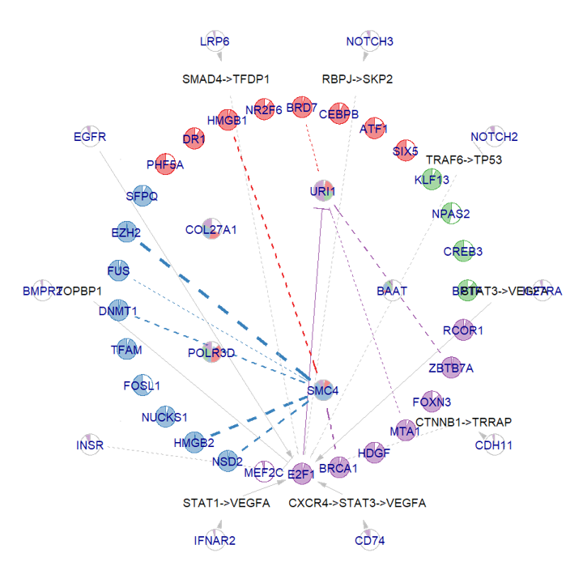

# NeighbourNet

  

The NeighbourNet (NNet) package is currently under development. 

The data and the reproducible R scripts used to generate the figures in the manuscript can be found at [](https://doi.org/10.5281/zenodo.15031726).

Note that the functions implemented in the final R package will differ from those used in the analysis presented in our paper.

The main difference lies in how NNet prunes the inferred co-expression networks. The functions used in our paper's analysis are provided in [this script](./tests/script.R) and can be directly sourced into R’s global environment. For now, if you wish to use the alternative pruning strategy intended for the R package, please source the R script located [here](./tests/script.new.R).

In comparison, the pruning strategy described in the paper is heuristic and less statistically rigorous, although it yields better results in our numerical evaluation. We conducted an analysis, available [here](./tests/investigate.pruning.md), to compare and understand the differences between the two strategies. 

Test at [here](articles/test.html)

# ⚡ 5‑Minute Quick‑Start

This mini‑walkthrough reproduces the **full vignette** in about 25 lines.  
The full vignette can be found in [here](./tests/vignettes.for.script.md).

---

## 1 · Install / load core packages

```r
pkgs <- c("Seurat","dplyr","Matrix","ggplot2","ggraph",
          "scatterpie","ggrepel","ggpubr","igraph")
if(any(miss <- !pkgs %in% installed.packages()[,1]))
    install.packages(pkgs[miss], repos = "https://cloud.r-project.org")
invisible(lapply(pkgs, library, character.only = TRUE))

# Source NeighbourNet (in develop)
source("tests/script.new.R")
```

---

## 2 · Fetch priors & demo dataset (can be found in the data folder)

```r
# local copies?  ->  ../data/*.rda
lapply(c("gene.list","sig.graph","gr.graph","receptor.ppr"),
       \(f) load(file.path("data", paste0(f,".rda"))))

# Seurat object with ~4 k LUAD cells
load("data/luad.rda")     # loads `obj`
```

---

## 3 · One‑liner preprocessing

```r
rt.ppr <- get.ppr()                        # receptor‑target prior matrix
genes  <- select.gene(obj, min.cells = 10) # QC → TF / target lists

obj <- obj |>
  prepare.seurat(genes = genes$genes) |>   # scale + PCA
  prepare.graph() |>                       # 30‑NN graph
  select.cell() |>                         # subsample 
  prepare.reg(predictors = genes$tfs,      # local variance scaffolding
              responses  = genes$targets)
```

---

## 4 · Run NeighbourNet and build meta‑networks

```r
top10 <- head(genes$targets, 10)           # demo: first 10 targets
obj   <- run.nn.reg(obj, responses = top10, return.p.val = TRUE) |>
         build.meta.network() |>
         select.central.genes() |>
         prepare.visualise()
```

`obj@misc$mod` now contains:

| slot | description |
|------|-------------|
| `effect` | (response × predictor × cell) co‑expression tensor |
| `p.val`  | matching significance tensor |
| `meta.network` | (response × predictor × meta‑cell) ensemble |

---

## 5.1 · Snapshot plot (Cell #1)

```r
visualise.network(obj, 1, 
                  radius = c(.4,.7,.85,1), pie.radius = .04,
                  text.size = 5)
```

## 5.2 · Snapshot plot (meta‑network #1)

```r
cut <- mean(apply(obj@misc$mod$meta.network$p.val[,,1], 1, max))
visualise.network(obj, 1, meta.network = TRUE, cutoff = cut,
                  radius = c(.4,.7,.85,1), pie.radius = .04,
                  text.size = 5)
```

---

## 6 · (Option) Receptor activity per cell

```r
act  <- receptor.activity(obj)             # matrix: receptor × cell
lrp6 <- act$receptor.act["LRP6", ]
```

Plot on PCA:

```r
library(ggplot2)
ggplot(Embeddings(obj, "pca"), aes(PC_1, PC_2)) +
  geom_point(alpha = .2, size = .6, colour = "grey80") +
  geom_point(data = Embeddings(obj, "pca")[names(lrp6), ],
             aes(col = as.numeric(lrp6)), size = 1)
```

---

### ✨ That’s it

You now have a full NeighbourNet analysis in under two minutes of run‑time.  
Tweak gene lists, increase `responses`, or switch visualisation parameters exactly as in the full vignette.

