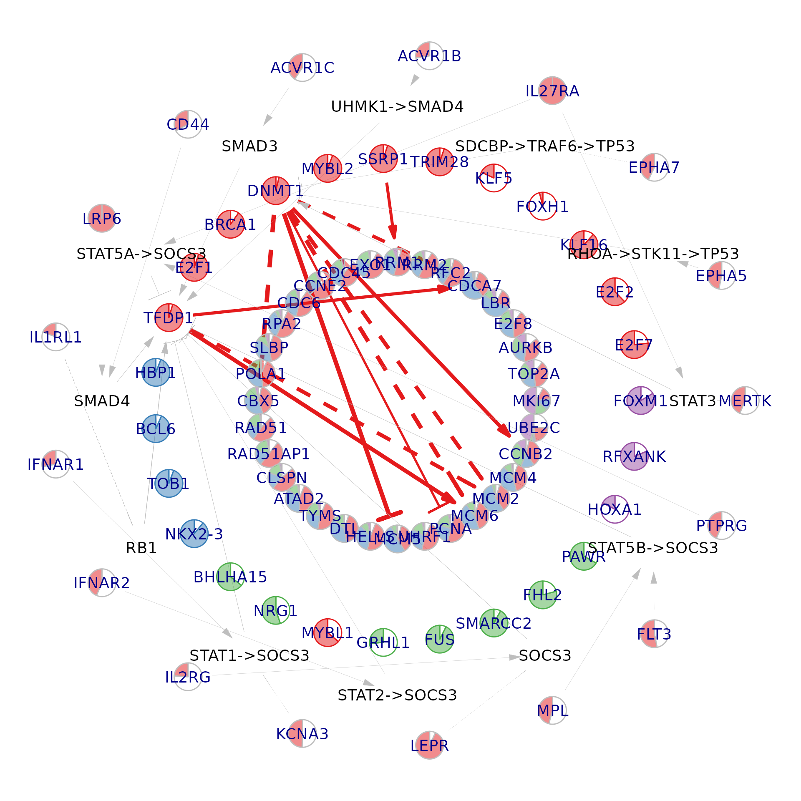
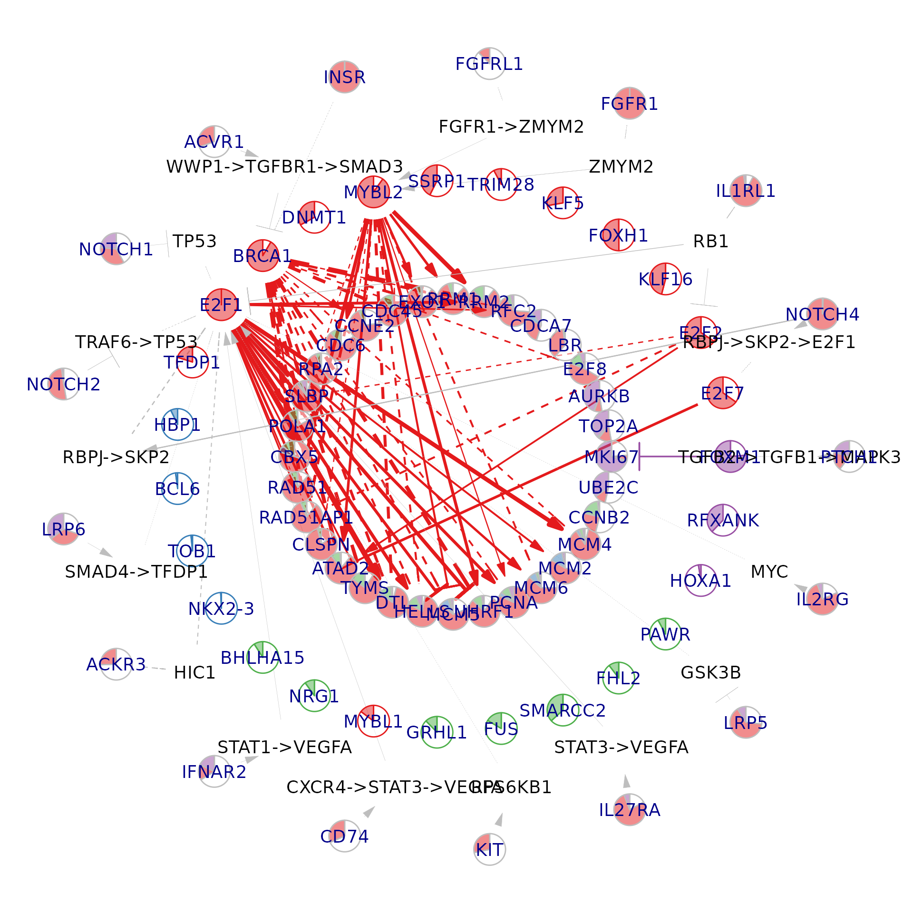
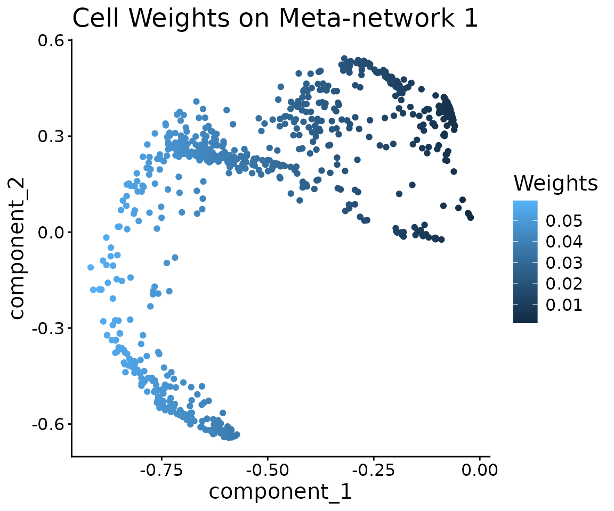
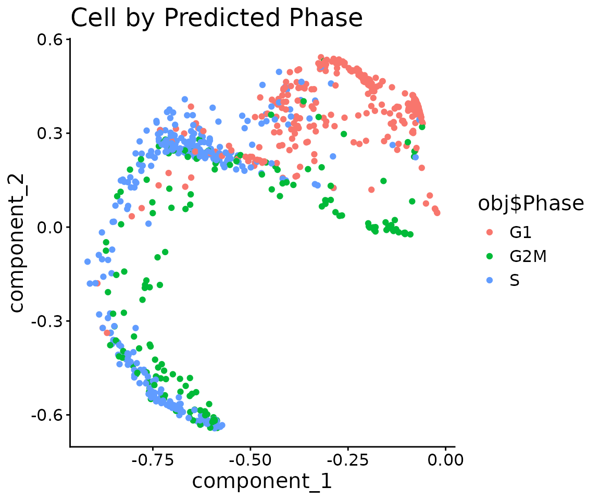
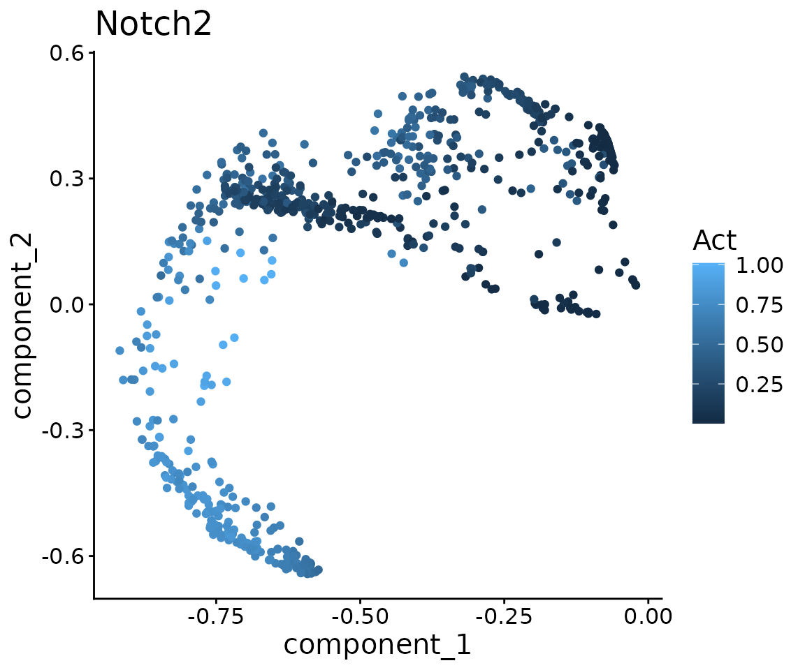

# NeighbourNet: Workflow Example

``` r

library(Seurat)
#> Loading required package: SeuratObject
#> Loading required package: sp
#> 
#> Attaching package: 'SeuratObject'
#> The following objects are masked from 'package:base':
#> 
#>     intersect, t
library(NeighbourNet)
library(ggplot2)
library(igraph)
#> 
#> Attaching package: 'igraph'
#> The following object is masked from 'package:Seurat':
#> 
#>     components
#> The following objects are masked from 'package:stats':
#> 
#>     decompose, spectrum
#> The following object is masked from 'package:base':
#> 
#>     union
library(patchwork)

# Data of murine hematopoietic progenitors generated by Nestorowa et al. (2016)
# We acquired the data from the Seurat vignette that demonstrate cell-cycle scoring 
# https://satijalab.org/seurat/articles/cell_cycle_vignette.html
exp.mat <- read.table(
  file = "./nestorawa_forcellcycle_expressionMatrix.txt",
  header = TRUE,
  row.names = 1,
  check.names = FALSE
)

# Cell-cycle markers from Tirosh et al. (2015) are available via Seurat.
# These are separated into S-phase and G2/M-phase markers.
s.genes  <- cc.genes$s.genes
g2m.genes <- cc.genes$g2m.genes

# Create a Seurat object and run basic preprocessing
obj <- CreateSeuratObject(
  counts = Matrix::Matrix(as.matrix(exp.mat), sparse = TRUE)
)
obj <- NormalizeData(obj)
#> Normalizing layer: counts
obj <- CellCycleScoring(
  obj,
  s.features   = s.genes,
  g2m.features = g2m.genes,
  set.ident    = TRUE
)
#> Warning: The following features are not present in the object: MLF1IP, GMNN,
#> not searching for symbol synonyms
```

## Preprocessing

We first perform quality control and gene selection, then prepare the
object for NeighbourNet.

``` r

# Filter out lowly expressed genes and annotate TFs/targets/receptors/ligands
genes <- NeighbourNet::select.gene(obj, min.cells = 10)
```

Run PCA on the selected genes. Co-expression will be measured within
this gene set.

``` r

obj <- NeighbourNet::prepare.seurat(obj, genes = genes$genes)
#> Running Seurat scaling and PCA...
```

Construct the KNN graph used by NeighbourNet.

``` r

obj <- NeighbourNet::prepare.graph(obj)
#> Building KNN graph...
```

Optionally, for data sets with many cells (\> 5000), you can run the
regression on a subset of representative cells.

``` r

# Not run
obj <- NeighbourNet::select.cell(obj)
```

Finally, set up the regression problem and compute local variance.

``` r

# Local variance is computed for predictor and response genes.
# Response genes are low-rank approximated.
# Here we measure co-expression between TFs (predictors) and cell-cycle targets (responses).
targets <- c(s.genes, g2m.genes)

obj <- NeighbourNet::prepare.reg(
  obj,
  predictors = genes$tfs,
  responses  = targets
)
#> Calculating local variance.
```

The NeighbourNet regression settings are stored in the `misc` slot:

``` r

Seurat::Misc(obj, "NNet.setting") %>% names()
#>  [1] "pcs"           "loadings"      "p"             "nn.idx"       
#>  [5] "nn.w"          "all.cells"     "all.genes"     "cells"        
#>  [9] "predictors"    "responses"     "genes"         "lra"          
#> [13] "scale.gene"    "nn.scale.gene" "nn.scale.pc"   "n.eff"
```

## NeighbourNet regression

Run NeighbourNet regression to obtain per-cell co-expression networks.

``` r

obj <- NeighbourNet::run.nn.reg(
  obj,
  responses    = targets,
  return.p.val = TRUE
)
#> Return smoothed effect, can only generate networks for sampled cells.
#> Return unpruned effect.
#> Return p-value.
#> Downstream analysis will be performed on the effect tensor.
#> Downstream analysis will perform network pruning.
#> Build the Laplacian operator.
#> Now regress.
```

The resulting network ensemble is stored in `NNet.mod` within the `misc`
slot.

``` r

# effect: (response × predictor × cell) tensor of co-expression effect sizes
# p.val : corresponding significance tensor
Seurat::Misc(obj, "NNet.mod") %>% names()
#>  [1] "effect"        "p.val"         "meta.network"  "meta.response"
#>  [5] "mus"           "sigmas"        "subsampled"    "smoothed"     
#>  [9] "pruned"        "gene.sets"     "cells"         "defaults"     
#> [13] "custom.y"      "w"
```

Build meta-networks summarising the per-cell networks.

``` r

obj <- NeighbourNet::build.meta.network(obj)
#> Now construct the covariance matrix.
#> Eigen decomposition.
#> Non-negative PCA.
```

Meta-networks are stored as a (response × predictor × meta-cell) tensor:

``` r

Seurat::Misc(obj, "NNet.mod")$meta.network$meta.network %>% dim()
```

## Visualisation

We next visualise key TF–target subnetworks and upstream signalling
structure.

### Select central genes

First, identify central genes based on eigenvector centrality across
meta-networks.

``` r

# All responses will be visualised when keep.responses = TRUE.
# n.net controls the number of meta-networks to examine.
# For each meta-network, k singular vectors are used, and
# n.per.component top-loading genes per component are selected.
central.genes <- NeighbourNet::select.central.genes(
  obj,
  keep.responses   = FALSE,
  n.per.component  = 4,
  n.net            = 5,
  k                = 2
)
```

### Prepare visualisation settings

``` r

# TFs (or the chosen g2 layer) are clustered into n.clu groups (colour-coded)
obj <- NeighbourNet::prepare.visualise(
  obj,
  central.genes = central.genes,
  n.clu         = 4
)
```

### Visualise a per-cell network

``` r

i <- 1
NeighbourNet::visualise.network(
  obj,
  i,
  cutoff      = 0.95,
  radius      = c(0.4, 0.7, 0.85, 1),
  pie.radius  = 0.04,
  text.size   = 5
)
#> Warning: The `vp` argument of `get_edge_ids()` supplied as a matrix should be a n times
#> 2 matrix, not 2 times n as of igraph 2.1.5.
#> ℹ either transpose the matrix with t() or convert it to a data.frame with two
#>   columns.
#> ℹ The deprecated feature was likely used in the igraph package.
#>   Please report the issue at <https://github.com/igraph/rigraph/issues>.
#> This warning is displayed once per session.
#> Call `lifecycle::last_lifecycle_warnings()` to see where this warning was
#> generated.
```



### Visualise a meta-network component

``` r

i <- 1
meta.p <- Seurat::Misc(obj, "NNet.mod")$meta.network$p.val[,, i]
cutoff <- apply(meta.p, 1, max) %>%
  sort(decreasing = TRUE) %>%
  mean()

NeighbourNet::visualise.network(
  obj,
  i,
  meta.network = TRUE,
  cutoff       = cutoff,
  radius       = c(0.4, 0.7, 0.85, 1),
  pie.radius   = 0.04,
  text.size    = 5
)
```



### Visualise meta-network components in PC space

We can also inspect which cells contribute to a given meta-network
component in the meta-network PC space.

``` r

i <- 1
pcs     <- Seurat::Misc(obj, "NNet.mod")$meta.network$pcs
weights <- Seurat::Misc(obj, "NNet.mod")$meta.network$npca.loadings[, i]

ggplot(pcs) +
  geom_point(aes(component_1, component_2, colour = weights)) +
  scale_color_continuous("Weights")+
  theme_classic() +
  theme(text = element_text(size = 15))+
  ggtitle("Cell Weights on Meta-network 1")
```



``` r


ggplot(pcs) +
  geom_point(aes(component_1, component_2, colour = obj$Phase)) +
  scale_color_discrete("Phase")+
  theme_classic() +
  theme(text = element_text(size = 15)) +
  ggtitle("Cell by Predicted Phase")
```



## Receptor activity

We now compute receptor activity scores using NeighbourNet’s
receptor-TF-target integration.

``` r

act <- NeighbourNet::receptor.activity(obj)
#> Now infer receptor activity.
```

### Visualise NOTCH2 activity and identify mediating TFs

``` r

notch2.act <- act$receptor.act["NOTCH2", ] %>% as.numeric()

ggplot(pcs) +
  geom_point(aes(component_1, component_2, colour = notch2.act)) +
  scale_color_continuous("Act")+
  theme_classic() +
  theme(text = element_text(size = 15))+
  ggtitle("Notch2")
```



``` r


tf.cor <- cor(notch2.act, t(act$tf.act)) %>%
  drop() %>%
  sort(decreasing = TRUE)
#> Warning in cor(notch2.act, t(act$tf.act)): the standard deviation is zero
head(tf.cor)
#>      E2F1      E2F2     SIN3A      E2F5      RFX1     ESRRA 
#> 0.9801520 0.7602014 0.5186611 0.5018902 0.3693210 0.3544060
```

We can inspect the inferred signalling path from NOTCH2 to a candidate
TF (e.g. E2F1) using the prior signalling graph:

``` r

igraph::shortest_paths(
  NeighbourNet::sig.graph,
  from    = "NOTCH2",
  to      = "E2F1",
  weights = 1 / igraph::E(NeighbourNet::sig.graph),
  output  = "both"
)$vpath
#> [[1]]
#> + 4/9867 vertices, named, from 2d729a0:
#> [1] NOTCH2 TRAF6  TP53   E2F1
```
