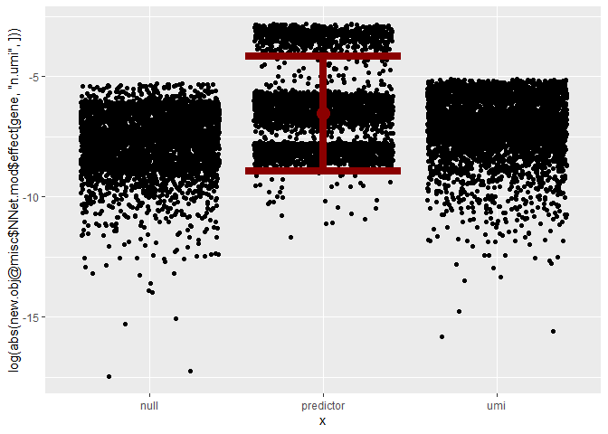
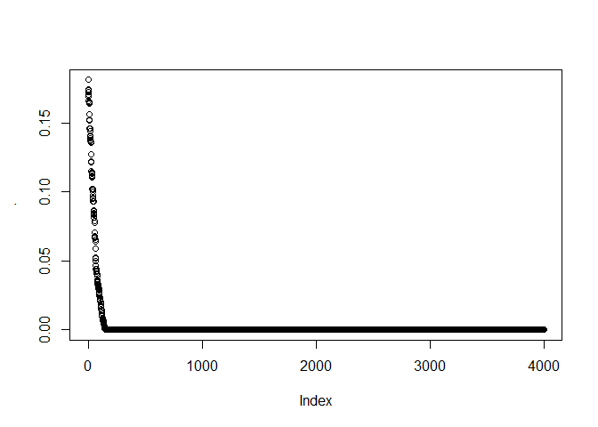
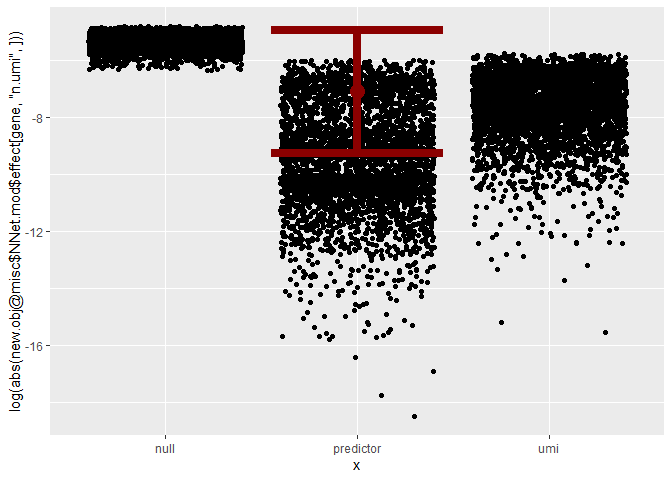
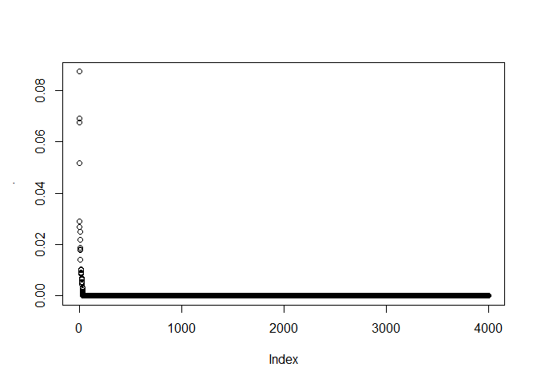
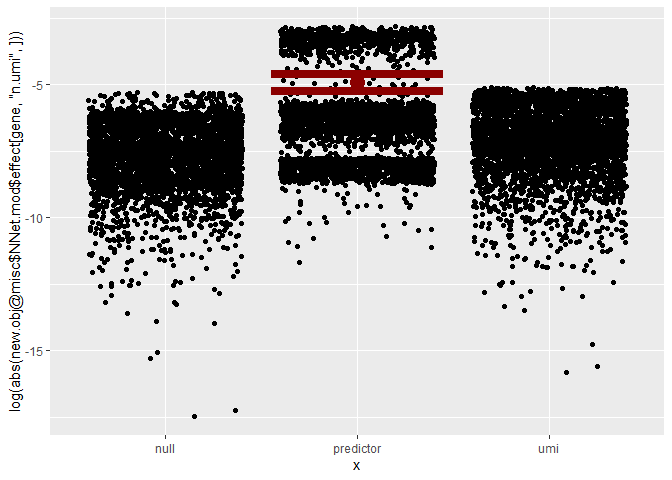
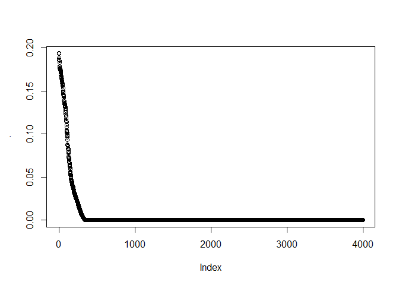
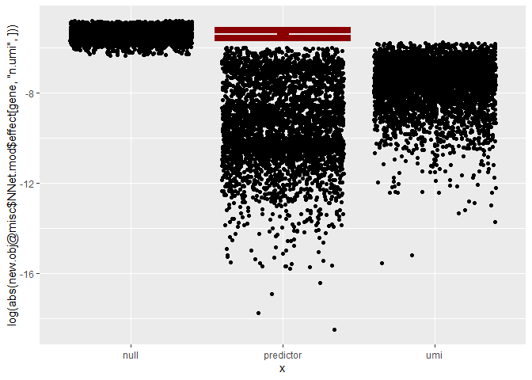
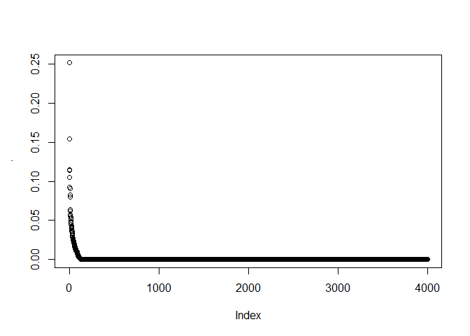

## Introduction

This vignette demonstrates the usage of the NeighbourNet package along
with ggplot2, dplyr, and Matrix for network regression analysis. We load
example data, preprocess it, and run both our current and alternative
network regression routines.

## Loading Libraries and Data

``` r
require(NeighbourNet)
```

    ## Loading required package: NeighbourNet

``` r
require(ggplot2)
```

    ## Loading required package: ggplot2

``` r
require(dplyr)
```

    ## Loading required package: dplyr

    ## 
    ## Attaching package: 'dplyr'

    ## The following objects are masked from 'package:stats':
    ## 
    ##     filter, lag

    ## The following objects are masked from 'package:base':
    ## 
    ##     intersect, setdiff, setequal, union

``` r
require(Matrix)
```

    ## Loading required package: Matrix

``` r
require(Seurat)
```

    ## Loading required package: Seurat

    ## Loading required package: SeuratObject

    ## Loading required package: sp

    ## 
    ## Attaching package: 'SeuratObject'

    ## The following objects are masked from 'package:base':
    ## 
    ##     intersect, t

``` r
# Load the example data
load("luad.rda")
```

## Preprocessing and Data Preparation

First, we identify variable features from the Seurat object and generate
a permuted dataset.

``` r
# Identify variable features
obj <- Seurat::FindVariableFeatures(obj)
```

    ## Finding variable features for layer counts

``` r
genes <- Seurat::VariableFeatures(obj)

# Create permuted data for null comparison
perm.data <- obj@assays$RNA$data[genes, ] %>% 
  apply(., 1, sample) %>% t
rownames(perm.data) <- paste("NULL", rownames(perm.data), sep = "-")
n.umi <- colSums(SeuratObject::LayerData(obj, "counts", features = genes))
n.umi <- sample(log(n.umi))
perm.data <- rbind(perm.data, n.umi)

# Create a new Seurat object with expanded gene set
new.obj <- Seurat::CreateSeuratObject(
  counts = rbind(obj@assays$RNA$data[genes, ], perm.data), 
  project = "celline",
  meta.data = data.frame(obj@meta.data)
)
SeuratObject::LayerData(new.obj, "data") <- SeuratObject::LayerData(new.obj, "counts")
null.genes <- rownames(perm.data)
expand.genes <- rownames(new.obj)
```

Next, we prepare the Seurat object for network regression by running the
necessary preprocessing steps.

``` r
new.obj <- prepare.seurat(new.obj, genes = expand.genes)
```

    ## Running Seurat scaling and PCA...

``` r
new.obj <- prepare.graph(new.obj)
```

    ## Building KNN graph...

``` r
new.obj <- prepare.reg(new.obj)
```

    ## Calculating local variance.

``` r
pcs <- Seurat::Misc(new.obj, "NNet.setting")$pcs
lra <- Seurat::Misc(new.obj, "NNet.setting")$lra
new.obj <- Seurat::RunUMAP(new.obj, dims = 1:ncol(pcs))
```

    ## Warning: The default method for RunUMAP has changed from calling Python UMAP via reticulate to the R-native UWOT using the cosine metric
    ## To use Python UMAP via reticulate, set umap.method to 'umap-learn' and metric to 'correlation'
    ## This message will be shown once per session

    ## 23:16:46 UMAP embedding parameters a = 0.9922 b = 1.112

    ## 23:16:46 Read 3918 rows and found 56 numeric columns

    ## 23:16:46 Using Annoy for neighbor search, n_neighbors = 30

    ## 23:16:46 Building Annoy index with metric = cosine, n_trees = 50

    ## 0%   10   20   30   40   50   60   70   80   90   100%

    ## [----|----|----|----|----|----|----|----|----|----|

    ## **************************************************|
    ## 23:16:46 Writing NN index file to temp file C:\Users\yidid\AppData\Local\Temp\Rtmps1ykq2\file7c7851bf6d60
    ## 23:16:46 Searching Annoy index using 1 thread, search_k = 3000
    ## 23:16:48 Annoy recall = 100%
    ## 23:16:48 Commencing smooth kNN distance calibration using 1 thread with target n_neighbors = 30
    ## 23:16:49 Initializing from normalized Laplacian + noise (using RSpectra)
    ## 23:16:49 Commencing optimization for 500 epochs, with 162078 positive edges
    ## 23:17:08 Optimization finished

``` r
umap <- data.frame(Seurat::Embeddings(new.obj, "umap"))
```

## The Old Pruning Stratagy

The following is the definition of the old.run.nn.reg function, which
provides an alternative method for network pruning.

``` r
old.run.nn.reg <- function(seurat.obj, responses = NULL, Y = NULL,
                           predictors = NULL, t = 3, k = NULL,
                           remove.self.loops = TRUE, f = function(x) 2*x^2, assay = c("effect", "p.val"),
                           prune = TRUE, cutoff = 0.5,
                           return.p.val = FALSE, return.smooth = TRUE, return.prune = FALSE) {
  # Retrieve the stored settings from the Seurat object
  setting <- Seurat::Misc(seurat.obj, "NNet.setting")

  # Ensure that prepare.seurat has been run
  if (is.null(setting)) stop("Run prepare.seurat first, then prepare.graph and prepare.reg.")

  # Ensure that prepare.graph has been run
  if (is.null(setting$p)) stop("Run prepare.graph first and then prepare.reg.")

  # Ensure that prepare.reg has been run
  if (is.null(setting$nn.scale.gene)) stop("Run prepare.reg first.")

  # Match the assay argument to valid options
  assay <- match.arg(assay)

  # Extract PC embedding (X matrix)
  X <- setting$pcs

  # Determine if subsampling of cells has been applied
  subsampled <- !is.null(setting$cells)
  if (!subsampled) {
    cells <- 1:nrow(X)  # Use all cells if no subsampling
    names(cells) <- rownames(X)
  } else {
    cells <- setting$cells  # Use preselected cells
    names(cells) <- rownames(X)[cells]
  }

  # Extract response matrix (Y) or use a custom one
  custom.y <- !is.null(Y)
  if (!custom.y) {
    # Select response genes with non-zero local variances
    responses <- intersect(setting$responses, responses)
    responses <- responses[rowSums(setting$nn.scale.gene[responses, names(cells), drop = FALSE]) > 0]
    Y <- setting$lra[, responses, drop = FALSE]  # Low-rank approximated response matrix
  } else {
    Y <- as.matrix(Y)
    responses <- colnames(Y)
    # Assign default names if the responses are unnamed
    if (is.null(responses)) responses <- colnames(Y) <- paste("Y", 1:ncol(Y), sep = "")
    message("Custom response is provided, will not prune or return p-value.")
    prune <- FALSE
    return.p.val <- FALSE
  }

  # Select predictors or use all available predictors
  if (is.null(predictors)) {
    predictors <- setting$predictors
  } else {
    predictors <- intersect(predictors, setting$genes)
  }

  # Determine the gene set to be used in the analysis
  if (!custom.y) {
    genes <- unique(c(responses, predictors))
  } else {
    genes <- predictors
  }

  # Normalize PC loadings
  loadings <- setting$loadings[genes, , drop = FALSE]
  loading.scale <- sqrt(rowSums(loadings^2))
  loadings <- loadings / loading.scale

  # Initialize variables for dimensions
  n.cell <- length(cells)
  n.gene <- length(genes)
  n.response <- length(responses)
  n.predictor <- length(predictors)
  n.pc <- ncol(X)
  if (is.null(k)) k <- ncol(setting$nn.idx)

  # Adjust logical flags for smooth and pruned effects
  if (!return.smooth) return.prune <- FALSE
  if (return.prune) prune <- FALSE

  # Display messages about the analysis settings
  message(ifelse(return.smooth, "Return smoothed effect, can only generate networks for sampled cells.", "Return raw effect."))
  message(ifelse(return.prune, "Return pruned effect.", "Return unpruned effect."))
  message(ifelse(return.p.val, "Return p-value.", "Will not return p-value."))
  message(ifelse(assay == "effect", "Downstream analysis will be performed on the effect tensor.", "Downstream analysis will be performed on the p-val tensor."))
  message(ifelse(prune, "Downstream analysis will perform network pruning.", "Downstream analysis will not perform network pruning."))

  # Retrieve transcription factors (TFs) and targets for reporting
  gene.list <- NeighbourNet::gene.list
  tfs.in.responses <- responses[responses %in% gene.list$tfs]
  tfs.in.predictors <- predictors[predictors %in% gene.list$tfs]
  targets.in.responses <- responses[responses %in% gene.list$targets]
  targets.in.predictors <- predictors[predictors %in% gene.list$targets]

  # Initialize a matrix for local variances of response genes
  nn.scale.y <- matrix(0, nrow = n.response, ncol = n.cell, dimnames = list(responses, names(cells)))

  # Calculate local variances for responses
  for (i in 1:n.cell) {
    j <- cells[i]
    idx <- setting$nn.idx[j, ]
    w <- setting$nn.w[j, ]

    # Compute residuals for response genes
    w.mean <- as.numeric(w %*% Y[idx, ])
    res <- t(Y[idx, ]) - w.mean
    nn.scale.y[, i] <- as.numeric(res^2 %*% w) * setting$n.eff[i] / (setting$n.eff[i] - 1)
  }
  nn.scale.y <- sqrt(nn.scale.y)

  # Build the Laplacian operator for smoothing
  message("Build the Laplacian operator.")
  svds.p <- RSpectra::svds(A = setting$p, k = k)  # Singular value decomposition
  u <- svds.p$u
  vd <- sweep(svds.p$v, 2, svds.p$d^t, "*")  # Scale singular vectors
  rownames(u) <- rownames(vd) <- rownames(X)
  d <- rowSums(tcrossprod(u, vd[cells, ]))  # Normalize scaling factor
  u <- u / d

  # Initialize tensors for storing effects and p-values
  effect.tensor <- array(dim = c(n.response, n.gene, n.cell), dimnames = list(responses, genes, names(cells)))
  p.val.tensor <- if (return.p.val) effect.tensor else NULL

  # Initialize containers for noise distribution statistics
  mus <- c()
  sigmas <- c()

  # Perform regression for each response gene
  message("Now regress.")

  # Progress bar initialization
  pb <- progress::progress_bar$new(format = "(:spin) [:bar] :percent [Elapsed time: :elapsedfull || Estimated time remaining: :eta]",
                                   total = n.response,
                                   complete = "=",   # Completion bar character
                                   incomplete = "-", # Incomplete bar character
                                   current = ">",    # Current bar character
                                   clear = FALSE,    # If TRUE, clears the bar when finish
                                   width = 100)      # Width of the progress bar

  for (i in 1:n.response) {
    pb$tick()
    r <- responses[i]

    # Initialize a matrix to store regression coefficients
    b <- matrix(0, nrow = n.cell, ncol = n.pc)
    for (j in 1:n.cell) {
      idx <- setting$nn.idx[cells[j], ]
      w <- setting$nn.w[cells[j], ]

      # Perform local scaling of data
      w.mean <- as.numeric(w %*% Y[idx, i])
      y <- scale(Y[idx, i], center = w.mean, scale = nn.scale.y[i, j])
      w.mean <- as.numeric(w %*% X[idx, ])
      x <- scale(X[idx, ], center = w.mean, scale = setting$nn.scale.pc[, j])

      # Perform local regression
      if (!is.na(attr(y, "scaled:scale"))) {
        lambda <- 5
        qr.mod <- qr(rbind(x * sqrt(w), diag(sqrt(lambda), ncol(x))))
        v <- qr.qty(qr.mod, c(y * sqrt(w), rep(0, ncol(x))))
        b[j, ] <- backsolve(qr.R(qr.mod), v) / attr(x, "scaled:scale") * attr(y, "scaled:scale")
      } else {
        b[j, ] <- rep(0, ncol(x))
      }
    }

    # Transform regression coefficients to effects
    b <- tcrossprod(loadings, b) %>% as.matrix

    # Calculate effect
    effect <- (b[genes, ] * setting$nn.scale.gene[genes, names(cells), drop = FALSE]) %>% as.matrix

    # Calculate p-value
    if(!custom.y){
      noise <- effect[i, ]
      noise <- replicate(100, sample(noise))
    } else {
      ref <- which.max(apply(abs(effect), 1, max))
      noise <- effect[ref, ]
      noise <- replicate(100, sample(noise))
    }
    noise <- u[cells, ] %*% crossprod(vd[cells, ], noise)
    noise <- log(abs(noise))
    mu <- mean(noise)
    sigma <- sd(noise)
    mus[i] <- mu
    sigmas[i]  <- sigma

    if (return.smooth | return.p.val) effect.hat <- tcrossprod(effect %*% vd[cells, ], u[cells, ])

    # Compute p-values if required
    if (return.p.val | return.prune) {
      p.val <- pnorm(log(abs(effect.hat)), mus[i], sigmas[i])
      if(return.p.val) p.val.tensor[i, , ] <- p.val
    }

    # Store smoothed or raw effects in the tensor
    if (return.smooth) {
      if (return.prune) effect.hat[p.val < cutoff] <- 0
      effect.tensor[i, , ] <- effect.hat
    } else {
      effect.tensor[i, , ] <- effect
    }
  }
  names(mus) <- names(sigmas) <- responses

  mod <- list(
    effect = effect.tensor, p.val = p.val.tensor, meta.network = NULL,
    mus = mus, sigmas = sigmas, subsampled = subsampled,
    smoothed = return.smooth, pruned = return.prune,
    gene.sets = list(
      predictors = list(genes = predictors, tfs = tfs.in.predictors, targets = targets.in.predictors),
      responses = list(genes = responses, tfs = tfs.in.responses, targets = targets.in.responses),
      genes = genes
    ),
    cells = cells,
    defaults = list(f = f, remove.self.loops = remove.self.loops, assay = assay, predictors = predictors, responses = responses, cutoff = cutoff, prune = prune),
    custom.y = custom.y, w = list(u = u, vd = vd)
  )

  class(mod) <- "NNet.mod"

  # Store results in the Seurat object
  suppressWarnings(
    Seurat::Misc(seurat.obj, "NNet.mod") <- mod
  )

  return(seurat.obj)  # Return the updated Seurat object
}
```

## Running NNet Regression with the New Pruning Stratagy

In this section we run the NNet Regression using our new prunning
Stratagy and visualize the effects.

``` r
i <- 1 # A gene index, can be modified.
gene <- genes[i]
new.obj <- run.nn.reg(new.obj, responses = gene, return.p.val = TRUE)
```

    ## Return smoothed effect, can only generate networks for sampled cells.

    ## Return unpruned effect.

    ## Return p-value.

    ## Downstream analysis will be performed on the effect tensor.

    ## Downstream analysis will perform network pruning.

    ## Build the Laplacian operator.

    ## Now regress.

``` r
predictor <- genes[i]
mu <- new.obj@misc$NNet.mod$mus
sigma <- new.obj@misc$NNet.mod$sigmas

# Plot the effect estimates for 'total umi as a predictor (umi)', 'response as a predictor (predictor)', and 'permuted response as a predictor (null)'
# Check the inferred null distribution of effect sizes (red error bar)
ggplot() +
  geom_jitter(aes(x = "umi", y = log(abs(new.obj@misc$NNet.mod$effect[gene, "n.umi", ])))) +
  geom_jitter(aes(x = "predictor", y = log(abs(new.obj@misc$NNet.mod$effect[gene, predictor, ])))) +
  geom_jitter(aes(x = "null", y = log(abs(new.obj@misc$NNet.mod$effect[gene, paste("NULL", predictor, sep = "-"), ])))) +
  geom_errorbar(aes(x = "predictor", ymin = mu - 1.96 * sigma, ymax = mu + 1.96 * sigma), 
                color = "darkred", size = 3) +
  geom_point(aes(x = "predictor", y = mu), color = "darkred", size = 5)
```

    ## Warning: Using `size` aesthetic for lines was deprecated in ggplot2 3.4.0.
    ## ℹ Please use `linewidth` instead.
    ## This warning is displayed once every 8 hours.
    ## Call `lifecycle::last_lifecycle_warnings()` to see where this warning was
    ## generated.



``` r
# Summarize false discovery rate
rowMeans(log(abs(new.obj@misc$NNet.mod$effect)[1, , ]) > mu + 1.96 * sigma) %>% 
  sort(decreasing = TRUE) %>% plot
```



### Use a Permuted Feature as the Response

``` r
i <- 1
gene <- null.genes[i]
new.obj <- run.nn.reg(new.obj, responses = gene, return.p.val = TRUE)
```

    ## Return smoothed effect, can only generate networks for sampled cells.

    ## Return unpruned effect.

    ## Return p-value.

    ## Downstream analysis will be performed on the effect tensor.

    ## Downstream analysis will perform network pruning.

    ## Build the Laplacian operator.

    ## Now regress.

``` r
predictor <- genes[i]
mu <- new.obj@misc$NNet.mod$mus
sigma <- new.obj@misc$NNet.mod$sigmas

# Plot the effect estimates for 'total umi as a predictor (umi)', 'response as a predictor (null)', and 'response before permutation as a predictor (predictor)'
# Check the inferred null distribution of effect sizes (red error bar)
ggplot() +
  geom_jitter(aes(x = "umi", y = log(abs(new.obj@misc$NNet.mod$effect[gene, "n.umi", ])))) +
  geom_jitter(aes(x = "predictor", y = log(abs(new.obj@misc$NNet.mod$effect[gene, predictor, ])))) +
  geom_jitter(aes(x = "null", y = log(abs(new.obj@misc$NNet.mod$effect[gene, paste("NULL", predictor, sep = "-"), ])))) +
  geom_errorbar(aes(x = "predictor", ymin = mu - 1.96 * sigma, ymax = mu + 1.96 * sigma), 
                color = "darkred", size = 3) +
  geom_point(aes(x = "predictor", y = mu), color = "darkred", size = 5)
```



``` r
# Should have a low false discovery rate
rowMeans(log(abs(new.obj@misc$NNet.mod$effect)[1, , ]) > mu + 1.96 * sigma) %>% 
  sort(decreasing = TRUE) %>% plot
```



## Running the Old Regression Function

We now run the old regression function to compare results.

``` r
i <- 1 # A gene index, can be modified.
gene <- genes[i]
new.obj <- old.run.nn.reg(new.obj, responses = gene, return.p.val = TRUE)
```

    ## Return smoothed effect, can only generate networks for sampled cells.

    ## Return unpruned effect.

    ## Return p-value.

    ## Downstream analysis will be performed on the effect tensor.

    ## Downstream analysis will perform network pruning.

    ## Build the Laplacian operator.

    ## Now regress.

``` r
predictor <- genes[i]
mu <- new.obj@misc$NNet.mod$mus
sigma <- new.obj@misc$NNet.mod$sigmas

# Plot the effect estimates for 'total umi as a predictor (umi)', 'response as a predictor (predictor)', and 'permuted response as a predictor (null)'
# Check the inferred null distribution of effect sizes (red error bar)
ggplot() +
  geom_jitter(aes(x = "umi", y = log(abs(new.obj@misc$NNet.mod$effect[gene, "n.umi", ])))) +
  geom_jitter(aes(x = "predictor", y = log(abs(new.obj@misc$NNet.mod$effect[gene, predictor, ])))) +
  geom_jitter(aes(x = "null", y = log(abs(new.obj@misc$NNet.mod$effect[gene, paste("NULL", predictor, sep = "-"), ])))) +
  geom_errorbar(aes(x = "predictor", ymin = mu - 1.64 * sigma, ymax = mu + 1.64 * sigma), 
                color = "darkred", size = 3) +
  geom_point(aes(x = "predictor", y = mu), color = "darkred", size = 5)
```



``` r
# Summarize false discovery rate
rowMeans(log(abs(new.obj@misc$NNet.mod$effect)[1, , ]) > mu + 1.64 * sigma) %>% 
  sort(decreasing = TRUE) %>% plot
```



### Use a Permuted Feature as the Response

``` r
i <- 1
gene <- null.genes[i]
new.obj <- old.run.nn.reg(new.obj, responses = gene, return.p.val = TRUE)
```

    ## Return smoothed effect, can only generate networks for sampled cells.

    ## Return unpruned effect.

    ## Return p-value.

    ## Downstream analysis will be performed on the effect tensor.

    ## Downstream analysis will perform network pruning.

    ## Build the Laplacian operator.

    ## Now regress.

``` r
predictor <- genes[i]
mu <- new.obj@misc$NNet.mod$mus
sigma <- new.obj@misc$NNet.mod$sigmas

# Plot the effect estimates for 'total umi as a predictor (umi)', 'response as a predictor (null)', and 'response before permutation as a predictor (predictor)'
# Check the inferred null distribution of effect sizes (red error bar)
ggplot() +
  geom_jitter(aes(x = "umi", y = log(abs(new.obj@misc$NNet.mod$effect[gene, "n.umi", ])))) +
  geom_jitter(aes(x = "predictor", y = log(abs(new.obj@misc$NNet.mod$effect[gene, predictor, ])))) +
  geom_jitter(aes(x = "null", y = log(abs(new.obj@misc$NNet.mod$effect[gene, paste("NULL", predictor, sep = "-"), ])))) +
  geom_errorbar(aes(x = "predictor", ymin = mu - 1.64 * sigma, ymax = mu + 1.64 * sigma), 
                color = "darkred", size = 3) +
  geom_point(aes(x = "predictor", y = mu), color = "darkred", size = 5)
```



``` r
# Should have a low false discovery rate
rowMeans(log(abs(new.obj@misc$NNet.mod$effect)[1, , ]) > mu + 1.64 * sigma) %>% 
  sort(decreasing = TRUE) %>% plot
```



## Evaluation of Power and FDR

Finally, we evaluate the NNet regression by computing power and false
discovery rate (FDR) metrics.

``` r
response.list <- tapply(genes, cut(1:length(genes), breaks = 200), list)

# Calculate power and FDR for one set of responses
one.iter <- function(responses, old = FALSE){
  predictors <- paste("NULL", responses, sep = "-")
  
  if(old){
     new.obj <- old.run.nn.reg(new.obj, responses, return.p.val = TRUE, predictors = predictors)
  }else{
     new.obj <- run.nn.reg(new.obj, responses, return.p.val = TRUE, predictors = predictors)
  }

  # Calculate power and FDR for one response
  evaluation <- function(p){
    null.p <- paste("NULL", p, sep = "-")
    p.val <- new.obj@misc$NNet.mod$p.val[p, p, ]
    null.p.val <- new.obj@misc$NNet.mod$p.val[p, null.p, ]
    expressed <- new.obj@assays$RNA$data[p, ] != 0
    plot.df <- data.frame(expressed = expressed, p.val = p.val, null.p.val = null.p.val)
    plot.df %>% group_by(expressed) %>%
      dplyr::summarise(power = mean(p.val > 0.9), fdr =  mean(null.p.val > 0.9)) %>%
      dplyr::select(-1) %>%
      unlist(use.names = TRUE)
  }
  
  sapply(responses, evaluation)
}
```

### Try on One Set of Responses

New stratagy

``` r
one.iter(response.list[[1]], old = FALSE)
```

    ## Return smoothed effect, can only generate networks for sampled cells.

    ## Return unpruned effect.

    ## Return p-value.

    ## Downstream analysis will be performed on the effect tensor.

    ## Downstream analysis will perform network pruning.

    ## Build the Laplacian operator.

    ## Now regress.

    ##            S100A9     S100A2       DHRS2       NTS   MIR205HG      CCL20
    ## power1 0.07155556 0.15142198 0.005315822 0.2371018 0.06339978 0.04349248
    ## power2 0.32853717 0.56858999 0.586111111 0.5714286 0.67973856 0.73255814
    ## fdr1   0.00000000 0.00000000 0.000000000 0.0000000 0.00000000 0.00000000
    ## fdr2   0.00000000 0.01490256 0.000000000 0.0000000 0.00000000 0.00000000
    ##              CGA       MMP7       MT1E     DEFB4B
    ## power1 0.1462005 0.08370636 0.02351432 0.06117274
    ## power2 0.8249453 0.60926366 0.72324256 0.76671035
    ## fdr1   0.0000000 0.00000000 0.00000000 0.00000000
    ## fdr2   0.0000000 0.00000000 0.00000000 0.00000000

Old stratagy

``` r
one.iter(response.list[[1]], old = TRUE)
```

    ## Return smoothed effect, can only generate networks for sampled cells.

    ## Return unpruned effect.

    ## Return p-value.

    ## Downstream analysis will be performed on the effect tensor.

    ## Downstream analysis will perform network pruning.

    ## Build the Laplacian operator.

    ## Now regress.

    ##            S100A9     S100A2       DHRS2       NTS   MIR205HG      CCL20
    ## power1 0.06844444 0.05995388 0.005315822 0.2060897 0.05786268 0.04349248
    ## power2 0.32434053 0.30913259 0.586111111 0.5013477 0.67647059 0.72906977
    ## fdr1   0.00000000 0.00000000 0.000000000 0.0000000 0.00000000 0.00000000
    ## fdr2   0.00000000 0.00000000 0.000000000 0.0000000 0.00000000 0.00000000
    ##              CGA       MMP7       MT1E     DEFB4B
    ## power1 0.1456227 0.04968666 0.02351432 0.05419968
    ## power2 0.8249453 0.48337292 0.72450918 0.75229358
    ## fdr1   0.0000000 0.00000000 0.00000000 0.00000000
    ## fdr2   0.0000000 0.00000000 0.00000000 0.00000000

### Try on all responses (Not run)

``` r
result <- lapply(response.list, one.iter)

# Adjust formatting if necessary
bad.result <- which(sapply(result, is.list))
result[bad.result] <- lapply(result[bad.result], function(x){
  sapply(x, function(x){
    if(length(x) < 4){
      new.x <- rep(0, 4)
      names(new.x) <- c("power1", "power2", "fdr1", "fdr2")
      new.x[c(2, 4)] <- x
      new.x
    } else {
      x
    }
  })
})
result <- do.call(cbind, result)
result <- reshape2::melt(result)
result <- result %>% mutate(expressed = Var1 %in% c("power2", "fdr2"), 
                            type = ifelse(Var1 %in% c("power1", "power2"), "Sensitivity", "1-Specificity"))

# Visualize the result
ggplot(result) +
  geom_violin(aes(Var1, value, fill = expressed)) +
  ylim(0, 1) +
  geom_jitter(aes(Var1, value), size = 0.5) +
  facet_wrap(~type, scales = "free_x") +
  scale_fill_manual("Response expressed?", values = c("darkblue", "darkred")) +
  theme_classic() +
  theme(text = element_text(size = 15, face = "bold"),
        axis.ticks = element_blank(), legend.position = "none") +
  xlab("Response expressed?") +
  ylab("Rate") +
  scale_x_discrete(labels = c("Not expressed", "Expressed", "Not expressed", "Expressed"))
```
