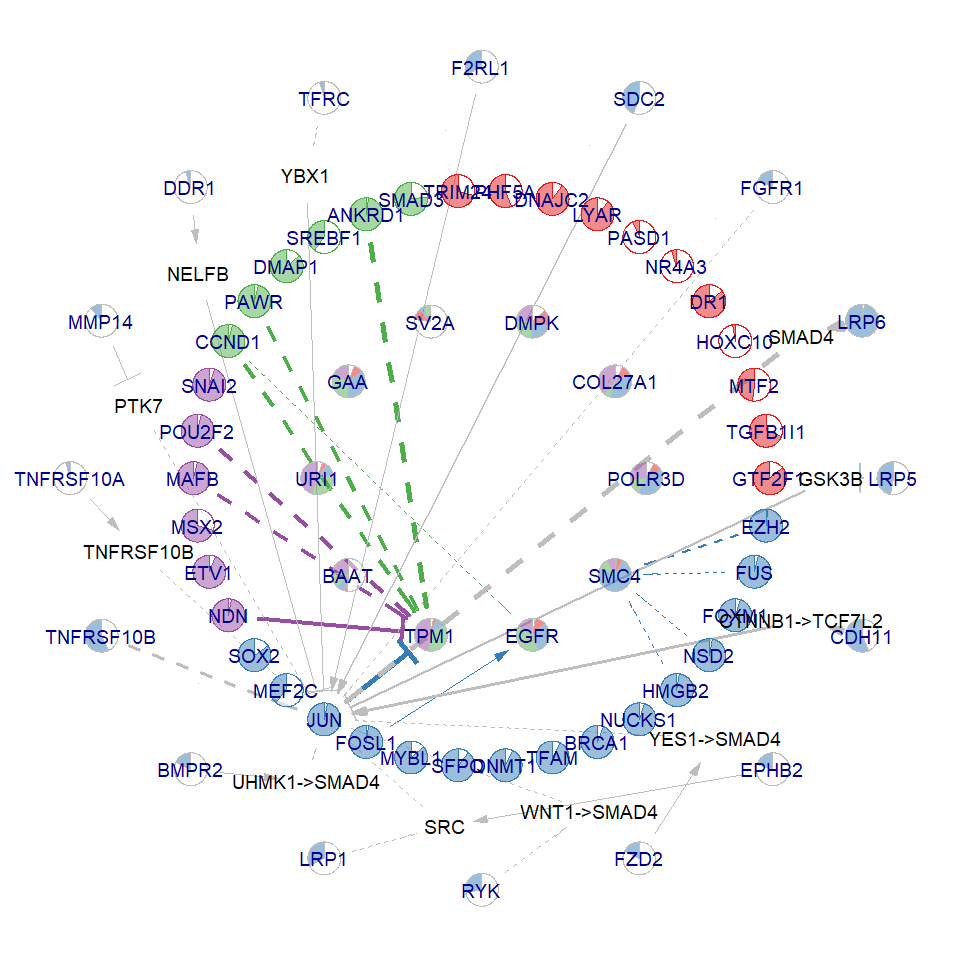
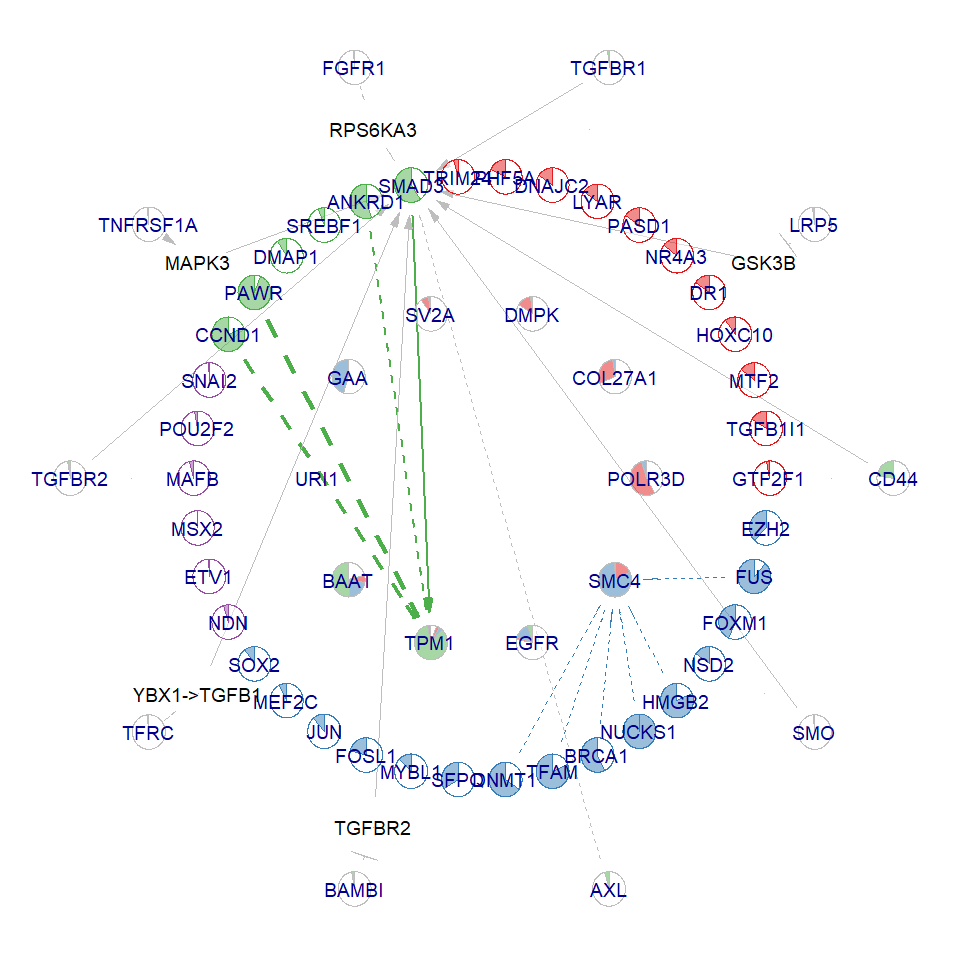
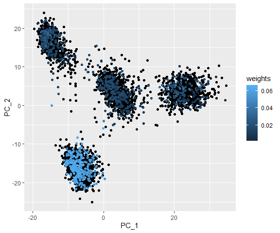
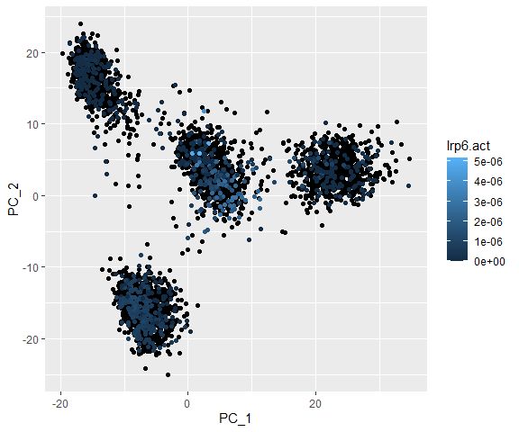

``` r
knitr::opts_chunk$set(echo = TRUE)
```

## Introduction

This vignette demonstrates the usage of the NeighbourNet by sourcing the
provided R script into the global environment.

## Install dependencies

``` r
uninstalled.packages <- c("Seurat", "dplyr", "Matrix", "ggplot2", "ggraph", "scatterpie", "ggrepel", "ggpubr", "igraph")
uninstalled.packages <- uninstalled.packages[!uninstalled.packages%in%installed.packages()]
if(length(uninstalled.packages)){
  install.packages(uninstalled.packages)
}
```

## Source and read data

    ## Loading required package: Seurat

    ## Loading required package: SeuratObject

    ## Loading required package: sp

    ## 
    ## Attaching package: 'SeuratObject'

    ## The following objects are masked from 'package:base':
    ## 
    ##     intersect, t

    ## Loading required package: dplyr

    ## 
    ## Attaching package: 'dplyr'

    ## The following objects are masked from 'package:stats':
    ## 
    ##     filter, lag

    ## The following objects are masked from 'package:base':
    ## 
    ##     intersect, setdiff, setequal, union

    ## Loading required package: Matrix

    ## Loading required package: ggplot2

    ## Loading required package: ggraph

    ## 
    ## Attaching package: 'ggraph'

    ## The following object is masked from 'package:sp':
    ## 
    ##     geometry

    ## Loading required package: scatterpie

    ## scatterpie v0.2.4 Learn more at https://yulab-smu.top/

    ## 
    ## Attaching package: 'scatterpie'

    ## The following object is masked from 'package:sp':
    ## 
    ##     recenter

    ## Loading required package: ggrepel

    ## Loading required package: ggpubr

Then, load in the pre-computed prior knowledge networks that are
available at our
[github](https://github.com/meiosis97/NeighbourNet/tree/main/data).

``` r
load("../data/gene.list.rda")
load("../data/sig.graph.rda")
load("../data/gr.graph.rda")
load("../data/receptor.ppr.rda")
```

Alternatively, you can also download the prior knowledge networks
complied by NicheNet, which contain more but less confident interactions

``` r
# Not run
gene.list <-  readRDS(url("https://zenodo.org/records/15240485/files/gene.list.rds"))
sig.graph <-  readRDS(url("https://zenodo.org/records/15240485/files/sig.graph.rds"))
gr.graph <-  readRDS(url("https://zenodo.org/records/15240485/files/gr.graph.rds"))
receptor.ppr <-  readRDS(url("https://zenodo.org/records/15240485/files/receptor.ppr.rds"))
```

Read the demonstrating data, which should be a Seurat object.

``` r
load("data/luad.rda")
```

## Preprocess

Prepare receptor prior regulatory potential matrix on targets.

``` r
rt.ppr <- get.ppr()
```

Quality control to filter out lowly expressed genes. Remaining genes are
grouped by their annotations as transcriptional factors (TF), targets,
receptors, and ligands.

``` r
genes <- select.gene(obj, min.cells = 10)
```

Run PCA using genes selected. Co-expression will be measured within
these genes.

``` r
obj <- prepare.seurat(obj, genes = genes$genes)
```

    ## Run Seurat.

Construct a KNN graph

``` r
obj <- prepare.graph(obj)
```

    ## Now building knn graph.

Optionally, for data containing many cells (\>5000), run analysis on a
subset of representative cells.

``` r
obj <- select.cell(obj)
```

Finally, calculate local variance.

``` r
# Local variance will be calculated for predictor genes and response genes
# Reponse genes will be low rank approximated
# We want to measure co-expression between TFs and targets
obj <- prepare.reg(obj, predictors = genes$tfs, responses = genes$targets)
```

    ## Calculating local variance.

Now, the prerequisite settings of NeighbourNet regression are stored in
the `misc` slot of the Seurat object.

``` r
Misc(obj, "setting") %>% str
```

    ## List of 14
    ##  $ pcs          : num [1:3918, 1:49] 4.15 1.61 -18.67 4.71 1.72 ...
    ##   ..- attr(*, "dimnames")=List of 2
    ##   .. ..$ : chr [1:3918] "Lib90_00000" "Lib90_00001" "Lib90_00002" "Lib90_00003" ...
    ##   .. ..$ : chr [1:49] "PC_1" "PC_2" "PC_3" "PC_4" ...
    ##  $ loadings     : num [1:3995, 1:49] 0.00286 -0.00183 0.03787 -0.00224 -0.00568 ...
    ##   ..- attr(*, "dimnames")=List of 2
    ##   .. ..$ : chr [1:3995] "URI1" "TADA2A" "NUPR1" "MYRF" ...
    ##   .. ..$ : chr [1:49] "PC_1" "PC_2" "PC_3" "PC_4" ...
    ##  $ predictors   : chr [1:640] "URI1" "TADA2A" "NUPR1" "MYRF" ...
    ##  $ responses    : chr [1:3851] "COL27A1" "POLR3D" "SMC4" "URI1" ...
    ##  $ cells        : Named num [1:773] 3716 2610 2635 3043 3430 ...
    ##   ..- attr(*, "names")= chr [1:773] "Lib90_03759" "Lib90_02611" "Lib90_02637" "Lib90_03052" ...
    ##  $ p            :Formal class 'dgCMatrix' [package "Matrix"] with 6 slots
    ##   .. ..@ i       : int [1:175602] 0 1 4 5 19 22 38 49 61 64 ...
    ##   .. ..@ p       : int [1:3919] 0 54 111 147 255 339 376 408 465 501 ...
    ##   .. ..@ Dim     : int [1:2] 3918 3918
    ##   .. ..@ Dimnames:List of 2
    ##   .. .. ..$ : NULL
    ##   .. .. ..$ : NULL
    ##   .. ..@ x       : num [1:175602] 0.52867 0.0107 0.00334 0.02509 0.00484 ...
    ##   .. ..@ factors : list()
    ##  $ nn.idx       : int [1:3918, 1:30] 1 2 3 4 5 6 7 8 9 10 ...
    ##  $ nn.w         : num [1:3918, 1:30] 0.102 0.102 0.102 0.102 0.102 ...
    ##  $ lra          : num [1:3918, 1:3851] -0.2297 -0.0836 0.0749 -0.2167 -0.2838 ...
    ##   ..- attr(*, "dimnames")=List of 2
    ##   .. ..$ : chr [1:3918] "Lib90_00000" "Lib90_00001" "Lib90_00002" "Lib90_00003" ...
    ##   .. ..$ : chr [1:3851] "COL27A1" "POLR3D" "SMC4" "URI1" ...
    ##  $ scale.gene   : Named num [1:3995] 0.1135 0.2385 0.5815 0.3113 0.0858 ...
    ##   ..- attr(*, "names")= chr [1:3995] "COL27A1" "POLR3D" "SMC4" "URI1" ...
    ##  $ nn.scale.gene:Formal class 'dgeMatrix' [package "Matrix"] with 4 slots
    ##   .. ..@ Dim     : int [1:2] 3995 773
    ##   .. ..@ Dimnames:List of 2
    ##   .. .. ..$ : chr [1:3995] "COL27A1" "POLR3D" "SMC4" "URI1" ...
    ##   .. .. ..$ : chr [1:773] "Lib90_03759" "Lib90_02611" "Lib90_02637" "Lib90_03052" ...
    ##   .. ..@ x       : num [1:3088135] 0.15 0.222 0.644 0.337 0 ...
    ##   .. ..@ factors : list()
    ##  $ nn.scale.pc  : num [1:49, 1:773] 1.8 2.06 1.91 4.27 4.11 ...
    ##   ..- attr(*, "dimnames")=List of 2
    ##   .. ..$ : chr [1:49] "PC_1" "PC_2" "PC_3" "PC_4" ...
    ##   .. ..$ : chr [1:773] "Lib90_03759" "Lib90_02611" "Lib90_02637" "Lib90_03052" ...
    ##  $ n.eff        : Named num [1:773] 17.2 21.5 22.2 22.7 21.4 ...
    ##   ..- attr(*, "names")= chr [1:773] "Lib90_03759" "Lib90_02611" "Lib90_02637" "Lib90_03052" ...
    ##  $ genes        : chr [1:3995] "COL27A1" "POLR3D" "SMC4" "URI1" ...

Get cells on which co-expression will be measured.

``` r
cells <- Misc(obj, "setting")$cells
```

## NeighbourNet regression

For the demonstration purpose, we only use ten response genes to
construct co-expression networks.

``` r
(responses <- genes$targets[1:10])
```

    ##  [1] "COL27A1" "POLR3D"  "SMC4"    "URI1"    "BAAT"    "TPM1"    "GAA"    
    ##  [8] "DMPK"    "SV2A"    "EGFR"

NeighbourNet regression.

``` r
obj <- run.nn.reg(obj, responses = responses, return.p.val = T)
```

    ## Return smoothed effect, can only generate networks for sampled cells.

    ## Return unpruned effect.

    ## Return p-value.

    ## By default, downstream analysis will be performed on the effect tensor.

    ## By default, downstream analysis will perform network prunning.

    ## Build the Laplacian operator.

    ## Now regress.

    ## COL27A1

    ## POLR3D

    ## SMC4

    ## URI1

    ## BAAT

    ## TPM1

    ## GAA

    ## DMPK

    ## SV2A

    ## EGFR

The resulting network ensemble can be found also in the `misc` slot
under the name `mod`.

``` r
# effect: the (response x predictor x cell) ensemble of co-expression networks.
# p.val: the ensemble of co-expression significance corresponds to `effect`
Misc(obj, "mod") %>% str
```

    ## List of 14
    ##  $ effect       : num [1:10, 1:649, 1:773] 1.50e-03 -5.00e-04 4.81e-03 1.46e-03 1.43e-08 ...
    ##   ..- attr(*, "dimnames")=List of 3
    ##   .. ..$ : chr [1:10] "COL27A1" "POLR3D" "SMC4" "URI1" ...
    ##   .. ..$ : chr [1:649] "COL27A1" "POLR3D" "SMC4" "URI1" ...
    ##   .. ..$ : chr [1:773] "Lib90_03759" "Lib90_02611" "Lib90_02637" "Lib90_03052" ...
    ##  $ p.val        : num [1:10, 1:649, 1:773] 0.9459 0.3937 0.8968 0.6125 0.0017 ...
    ##   ..- attr(*, "dimnames")=List of 3
    ##   .. ..$ : chr [1:10] "COL27A1" "POLR3D" "SMC4" "URI1" ...
    ##   .. ..$ : chr [1:649] "COL27A1" "POLR3D" "SMC4" "URI1" ...
    ##   .. ..$ : chr [1:773] "Lib90_03759" "Lib90_02611" "Lib90_02637" "Lib90_03052" ...
    ##  $ meta.network : NULL
    ##  $ mus          : Named num [1:10] -8.68 -7.28 -6.76 -6.85 -11.32 ...
    ##   ..- attr(*, "names")= chr [1:10] "COL27A1" "POLR3D" "SMC4" "URI1" ...
    ##  $ sigmas       : Named num [1:10] 1.36 1.18 1.13 1.14 2.3 ...
    ##   ..- attr(*, "names")= chr [1:10] "COL27A1" "POLR3D" "SMC4" "URI1" ...
    ##  $ subsampled   : logi TRUE
    ##  $ smoothed     : logi TRUE
    ##  $ pruned       : logi FALSE
    ##  $ gene.sets    :List of 3
    ##   ..$ predictors:List of 3
    ##   .. ..$ genes  : chr [1:640] "URI1" "TADA2A" "NUPR1" "MYRF" ...
    ##   .. ..$ tfs    : chr [1:640] "URI1" "TADA2A" "NUPR1" "MYRF" ...
    ##   .. ..$ targets: chr [1:496] "URI1" "NUPR1" "TSG101" "HIC1" ...
    ##   ..$ responses :List of 3
    ##   .. ..$ genes  : chr [1:10] "COL27A1" "POLR3D" "SMC4" "URI1" ...
    ##   .. ..$ tfs    : chr "URI1"
    ##   .. ..$ targets: chr [1:10] "COL27A1" "POLR3D" "SMC4" "URI1" ...
    ##   ..$ genes     : chr [1:649] "COL27A1" "POLR3D" "SMC4" "URI1" ...
    ##  $ cells        : Named num [1:773] 3716 2610 2635 3043 3430 ...
    ##   ..- attr(*, "names")= chr [1:773] "Lib90_03759" "Lib90_02611" "Lib90_02637" "Lib90_03052" ...
    ##  $ defaults     :List of 7
    ##   ..$ f                :function (x)  
    ##   ..$ remove.self.loops: logi TRUE
    ##   ..$ assay            : chr "effect"
    ##   ..$ predictors       : chr [1:640] "URI1" "TADA2A" "NUPR1" "MYRF" ...
    ##   ..$ responses        : chr [1:10] "COL27A1" "POLR3D" "SMC4" "URI1" ...
    ##   ..$ cutoff           : num 0.95
    ##   ..$ prune            : logi TRUE
    ##  $ custom.y     : logi FALSE
    ##  $ w            :List of 2
    ##   ..$ u : num [1:3918, 1:30] -0.0609 -0.0677 -0.0707 -0.0753 -0.0748 ...
    ##   .. ..- attr(*, "dimnames")=List of 2
    ##   .. .. ..$ : chr [1:3918] "Lib90_00000" "Lib90_00001" "Lib90_00002" "Lib90_00003" ...
    ##   .. .. ..$ : NULL
    ##   ..$ vd: num [1:3918, 1:30] -0.0166 -0.0191 -0.016 -0.025 -0.022 ...
    ##   .. ..- attr(*, "dimnames")=List of 2
    ##   .. .. ..$ : chr [1:3918] "Lib90_00000" "Lib90_00001" "Lib90_00002" "Lib90_00003" ...
    ##   .. .. ..$ : NULL
    ##  $ return.smooth: logi TRUE

Build meta-networks.

``` r
obj <- build.meta.network(obj)
```

    ## Now construct the covariance matrix.

    ## COL27A1

    ## POLR3D

    ## SMC4

    ## URI1

    ## BAAT

    ## TPM1

    ## GAA

    ## DMPK

    ## SV2A

    ## EGFR

    ## Eigen decomposition.

    ## Non-negative PCA.

Meta-networks are also stored as a (response x predictor x meta-cell)
network ensemble.

``` r
Misc(obj, "mod")$meta.network$memeta.network %>% dim
```

## Visualisation

First, we identify the most connected genes to visualise.

``` r
# All responses will be visualised by `keep.responses = T`
# `n.net` controls the number of meta-networks to examine
# For each meta-network, eigenvector centrality of `k` sub-networks will be calculated
# On each eigenvector, `n.per.component` central genes will be selected to visualise
central.genes  <- select.central.genes(obj, keep.responses = T, n.per.component = 4, n.net = 5, k = 2)
```

Prepare visualisation parameters.

``` r
# TFs will be clustered into `n.clu` groups represented by different colours
obj <- prepare.visualise(obj, central.genes = central.genes, n.clu = 4)
```

Visualise the network of cell `i`.

``` r
i <- cells[10]
visualise.network(obj,i, cutoff = 0.95,
                  radius = c(0.4,0.7,0.85,1),pie.radius = 0.04, text.size = 5)
```

    ## Warning: `get.edge.ids()` was deprecated in igraph 2.1.0.
    ## ℹ Please use `get_edge_ids()` instead.
    ## This warning is displayed once every 8 hours.
    ## Call `lifecycle::last_lifecycle_warnings()` to see where this warning was
    ## generated.

    ## Warning: `permute.vertices()` was deprecated in igraph 2.0.0.
    ## ℹ Please use `permute()` instead.
    ## This warning is displayed once every 8 hours.
    ## Call `lifecycle::last_lifecycle_warnings()` to see where this warning was
    ## generated.

    ## Warning: `get.edgelist()` was deprecated in igraph 2.0.0.
    ## ℹ Please use `as_edgelist()` instead.
    ## This warning is displayed once every 8 hours.
    ## Call `lifecycle::last_lifecycle_warnings()` to see where this warning was
    ## generated.



Visualise meta-network `i`.

``` r
i <- 1
cutoff <- apply(obj@misc$mod$meta.network$p.val[,,i],1,max) %>% sort(decreasing = T) %>% mean
visualise.network(obj,i, meta.network = T, cutoff = cutoff,
                  radius = c(0.4,0.7,0.85,1),pie.radius = 0.04, text.size = 5)
```

    ## Warning: Removed 5 rows containing non-finite outside the scale range
    ## (`stat_pie()`).



Visualise which cells represent meta-network `i`.

``` r
i <- 1
weights <- obj@misc$mod$meta.network$npca.loadings[,i]
ggplot() + geom_point(data = Embeddings(obj,"pca"), aes(PC_1,PC_2)) + 
  geom_point(data = Embeddings(obj,"pca")[cells,], aes(PC_1,PC_2, col = weights))
```


\## Receptor activity

Calculate receptor activity for each cell.

``` r
act <- receptor.activity(obj)
```

Visualise the activity distribution of LRP6, and identify TFs with
highly correlated activities.

``` r
lrp6.act <- act$receptor.act["LRP6",] %>% as.numeric()
ggplot() + geom_point(data = Embeddings(obj,"pca"), aes(PC_1,PC_2)) + 
  geom_point(data = Embeddings(obj,"pca")[cells,], aes(PC_1,PC_2, col = lrp6.act))
```



``` r
cor(lrp6.act, t(act$tf.act)) %>% drop %>% sort 
```

    ## Warning in cor(lrp6.act, t(act$tf.act)): the standard deviation is zero

    ##     TGFB1I1        SFPQ       NR1H2       MYBL2       EPAS1         YY1 
    ## -0.23436736 -0.22050872 -0.18535154 -0.18433232 -0.18279110 -0.16703976 
    ##       ESRRA       SNAI1         RB1         REL      SREBF1       CLOCK 
    ## -0.16570604 -0.16432237 -0.15134971 -0.14623130 -0.14499265 -0.13223862 
    ##      STAT5B         VDR       KDM5B         AHR       PPARG        KAT5 
    ## -0.11044264 -0.11026694 -0.10472000 -0.09590079 -0.09341641 -0.09119584 
    ##       GATA2        MAFB        DLX2        USF2       NR3C1        PBX1 
    ## -0.09037135 -0.08912394 -0.08719102 -0.08029845 -0.07776153 -0.07605961 
    ##       KDM5C        MSX2       PRDM2        MTA1         SP3       NFIL3 
    ## -0.07351519 -0.06842290 -0.06641455 -0.06214424 -0.06084898 -0.05714620 
    ##        E2F4         FOS        JUND        BCL3       NFKB1        TP53 
    ## -0.05403517 -0.05166120 -0.04874402 -0.04536729 -0.03637087 -0.03576867 
    ##        RXRA        HES6       EWSR1       FOXA2         MAZ     SMARCC1 
    ## -0.02507150 -0.01469190 -0.01278912  0.02353263  0.03125413  0.03176561 
    ##       NCOA3       HDAC9        EGR1       MECOM        E2F1        HSF1 
    ##  0.03804905  0.04682376  0.05921529  0.06055866  0.08336832  0.11794130 
    ##        ELF3        RARA       FOXA1        IRF2         ID2       FOXM1 
    ##  0.11795243  0.11795592  0.11823532  0.11886785  0.12325953  0.13287226 
    ##        CUX1         JUN        YBX3       SMAD3        ELK3      BCLAF1 
    ##  0.13495698  0.14231493  0.20793331  0.22466139  0.23575172  0.25845377 
    ##       MEF2C        NFYC         AIP       CREB1        NRG1      NFE2L2 
    ##  0.30528459  0.32129249  0.33054993  0.34013795  0.34744649  0.34844606 
    ##       MECP2       KMT2A        FHL2        PURA       DNMT1       HDAC1 
    ##  0.35815293  0.35845965  0.37330754  0.40563518  0.41151894  0.42712949 
    ##        CTCF       FOSL1       MYBL1         MYC        ENO1      RBFOX2 
    ##  0.45644167  0.47944405  0.49013413  0.50047059  0.50115166  0.50263063 
    ##        MITF        ETS1       TFDP1        NONO     LRRFIP1       DMAP1 
    ##  0.50349973  0.51937894  0.53819339  0.54864611  0.57993536  0.58242423 
    ##        MUC1       KLF10       STAT1       HIF1A      HOXA10        MED1 
    ##  0.58529666  0.59028653  0.60538860  0.61515828  0.63444813  0.63743772 
    ##        RBPJ        SOX2       NR2F2       CTBP1     SMARCA4 
    ##  0.64003637  0.64192050  0.65089858  0.65267156  0.74264401

We identified potential JUN mediated LRP inhibition of TPM1.
